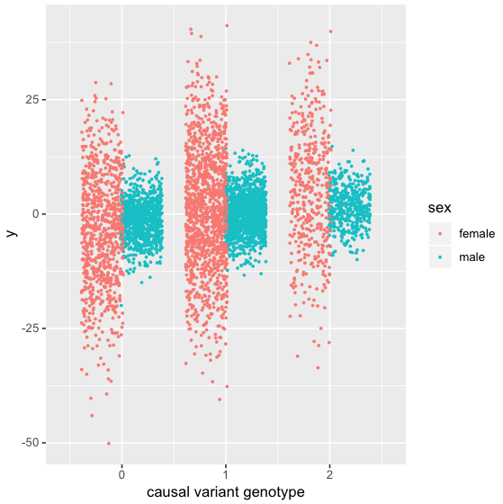

# LBR Tutorial

> How to implement local Bayesian regressions with gene-by-sex
interactions. It includes a toy dataset (simulated genotypes and phenotypes) for which
to test LBR on your local computer.

## Table of Contents

1. [Repository contents](#repository-contents)
2. [Description of data](#description-of-data)
3. [Initial Setup](#initial-setup)
4. [Fitting LBR with sex interactions](#fitting-lbr-with-sex-interactions)
5. [Processing posterior samples](#processing-posterior-samples)
6. [Example plots](#example-plots)

## Repository contents

- **Simulated genotype data** (sample size = 5000, number of SNPs = 1000)
- **Simulated phenotype data** for all 5000 individuals
- **A demonstration for how to fit LBR with sex interactions** using BGLR
- **Functions for processing BGLR output** to:
    - Estimate sex-specific effects at the level of individual SNP markers or LD-based regions.
    - Infer nonzero sex-specific effects and GxS interactions.

## Description of data

### Genotypes

Genotypes supplied in this repository were simulated using knowledge of real LD patterns.

Briefly, genotypes for SNP<sub>j</sub> were randomly sampled from the
conditional distribution of SNP<sub>j</sub> given SNP<sub>j-1</sub>, in which the
conditional distribution was estimated using UK Biobank genotypes.

### Phenotypes

A small dataset (**N = 5000**) is provided here so that one can easily test these
methods on their personal computer.

Given the small sample size, one causal variant
was used to explain a un-realistically large proportion of phenotypic variance
(**5% for both males and females**).

The additive effect of the causal variant is **three times larger in females
than in males**. Given that the heritability of the causal variant is the same in males
and females, this results in both larger genomic variance and larger residual
variance in females than in males.





## Initial setup

First clone this repository, cd into it, and launch the R interpreter.
This tutorial assumes you have **R version 3.6.0** or newer installed on your computer.

```sh
git clone https://github.com/funkhou9/LBR-sex-interactions.git
cd LBR-sex-interactions
R
```

## Fitting LBR with sex interactions

The packages BGLR and BGData are required to fit the LBR model. The tidyverse
package is recommended for downstream processing of posterior samples.

```r
install.packages(c("BGLR", "BGData", "tidyverse"))
library(BGLR)
library(BGData)
library(tidyverse)
```

Source additional functions provided in this repository

```r
source("src/getWindows.R")
source("src/process_samples.R")
```

Load toy genotype data, containing simulated genotype matrix `XS`.

Load toy phenotype data, containing:

1. Simulated phenotypes `y` and identifiers for males `men` and females `women`.
2. Identifier for the causal variant `cv`
3. Male-specific effect size for the causal variant `b_male` and female-specific
effect size for the causal variant `b_female`

```r
load("data/genotypes/DATA.RData")
load("data/phenotypes/DATA.RData")
```

Center and scale genotypes and phenotypes, and build sex-specific interaction
terms `WF` and `WM`.

```r
W <- scale(XS)
y <- scale(y)

WF <- W
dF <- ifelse(rownames(WF) %in% women, 1, 0)
for(i in 1:ncol(W)) {
  WF[, i] <- W[, i] * dF
}

WM <- W
dM <- ifelse(rownames(WM) %in% men, 1, 0)
for(i in 1:ncol(W)) {
  WM[, i] <- W[, i] * dM
}
```

Specify hyperparameters for each element of the linear predictor:

1. The **main effect of sex**, given a *uniform* prior,
2. The **main genetic effect**, given a *BayesC* prior ,
3. The **female-specific interaction**, given a *BayesC* prior,
4. The **male-specific interaction**, given a *BayesC* prior.

BayesC priors, also known as point-normal priors, are parameterized by:

- Pi, the proportion of non-null SNP effects. This is treated as random and given a Beta
prior (controlled by `counts` and `probIn` arguments).
- The variance of non-null SNP marker effects. This is treated as random and given a
scaled-inverse Chi-square prior (controlled by `R2` argument).

See the supplementary material from
[Perez and de los Campos 2014](https://www.ncbi.nlm.nih.gov/pmc/articles/PMC4196607/bin/supp_114.164442_164442SI.pdf)
for more information on prior densities used in BGLR.

> **NOTE:** When fitting real data, it is necessary to fit or pre-correct
> for additional covariates, which may include age, batch, genomic PCs, and genotyping center.

```r
ETA <- list(
  FIX = list(X = as.matrix(dF),
             model = 'FIXED'),
  main = list(X = W,
              R2 = 0.03,
              model = "BayesC",
              probIn = 0.5,
              counts = 4,
              saveEffects = TRUE),
  female = list(X = WF,
                R2 = 0.01,
                model = "BayesC",
                probIn = 0.5,
                counts = 4,
                saveEffects = TRUE),
  male = list(X = WM,
              R2 = 0.01,
              model = "BayesC",
              probIn = 0.5,
              counts = 4,
              saveEffects = TRUE)
)
```

**Run BGLR.** BGLR samples from the fully conditional posterior distributions
of interest using MCMC. Run 1200 iterations of the MCMC sampler, discarding the
initial 200 samples and thinning the samples by 2. BGLR allows for group-specific
residual error variances, using the `groups` argument.

```r
if (!dir.exists("LBR_results/")) dir.create("LBR_results/")
fm <- BGLR(y = y,
           ETA = ETA,
           groups = dF,
           R2 = 0.05,
           nIter = 1200,
           burnIn = 200,
           thin = 2,
           saveAt = "LBR_results/")
```

## Processing posterior samples

One can utilize the function provided in `src/process_samples.R`.

For each SNP, `process_samples()` provides:

-  Sex-specific SNP effect estimates
-  Posterior probability of non-zero sex-specific SNP effects
-  Posterior probability of sex difference in SNP effects

For each SNP, `process_samples()` also aggregates the effects of nearby SNPs within
LD based windows by estimating sex-specific "window variances". This provides:

-  Sex-specific window variance estimates
-  Posterior probability of non-zero sex-specific window variances
-  Posterior probability of sex difference in window variances

```r
results <- process_samples(X = W,
                           main = "LBR_results/ETA_main_b.bin",
                           male_int = "LBR_results/ETA_male_b.bin",
                           female_int = "LBR_results/ETA_female_b.bin")
```

The `results` object is a tibble with rows corresponding to each SNP<sub>j</sub>
and the following columns:

- `SNP`: SNP name
- `b_male`: male-specific SNP effect
- `b_female`: female-specific SNP effect
- `PP_male`: Posterior probability of a non-zero SNP effect in males
- `PP_female`: Posterior probability of a non-zero SNP effect in females
- `PP_diff`: Posterior probability of a sex difference in SNP effects
- `b_male_window`: male-specific window variance, centered on SNP<sub>j</sub>
- `b_female_window`: male-specific window variance, centered on SNP<sub>j</sub>
- `PP_male_window`: Posterior probability of a non-zero window variance in males
- `PP_female_window`: Posterior probability of a non-zero window variance in females
- `PP_diff_window`: Posterior probability of a sex difference in window variances

## Example plots


Plotting male-specific SNP effects against female-specific SNP effects and coloring
points by the posterior probability of sex difference.

```r
ggplot(results, aes(x = b_male, y = b_female, color = PP_diff)) +
  geom_point() +
  geom_abline(slope = 1, intercept = 0, col = "blue", alpha = 0.3) +
  geom_vline(xintercept = 0, col = "black", linetype = "dashed", alpha = 0.5) +
  geom_hline(yintercept = 0, col = "black", linetype = "dashed", alpha = 0.5) +
  scale_color_gradient(name = expression(PPDiff[SNP]),
                       high = "#f44242") +
  ylim(-0.2, 0.2) +
  xlim(-0.2, 0.2) +
  labs(x = expression(hat(beta)[m]), y = expression(hat(beta)[f]))
```


Miami-like plot to show male- and female-specific window variance estimates, coloring
points by posterior probability of sex-difference. The true position of the causal
variant is marked with a dashed blue line.

```r
ggplot() +
  geom_point(data = results,
             aes(x = seq_along(SNP),
                 y = b_male_window,
                 color = PP_diff_window)) +
  geom_segment(data = results,
               aes(x = seq_along(SNP),
                   y = b_male_window,
                   color = PP_diff_window,
                   xend = seq_along(SNP),
                   yend = 0)) +
  geom_point(data = results,
             aes(x = seq_along(SNP),
                 y = -b_female_window,
                 color = PP_diff_window)) +
  geom_segment(data = results,
               aes(x = seq_along(SNP),
                   y = -b_female_window,
                   color = PP_diff_window,
                   xend = seq_along(SNP),
                   yend = 0)) +
  scale_color_gradient(name = expression(PPDiff[sigma[g]^2]),
                       low = "#5D6D7E",
                       high = "#f44242") +
  geom_vline(xintercept = cv, linetype = "dashed", color = "blue", alpha = 0.5) +                     
  ylim(-0.05, 0.05) +
  geom_hline(yintercept = 0, color = "white") +
  labs(x = "Focal SNP",
       y = "-(Est. female window variance)             +(Est. male window variance)")
```


